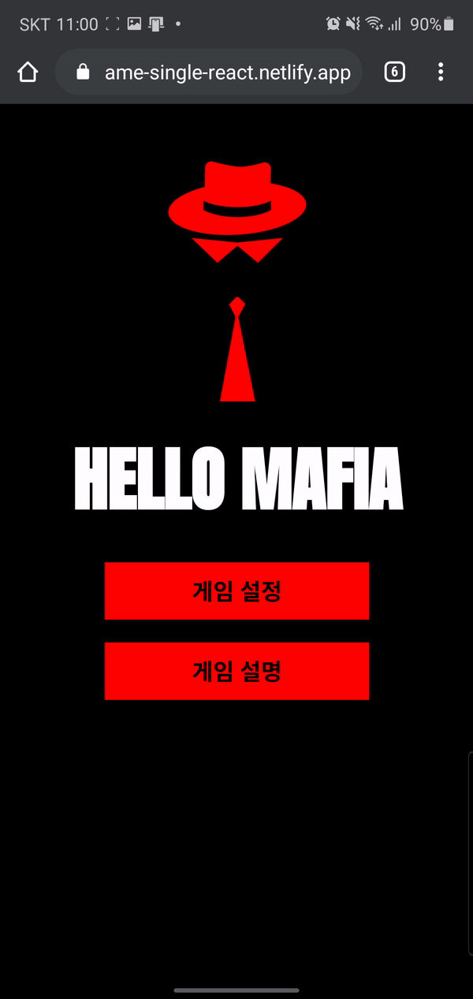
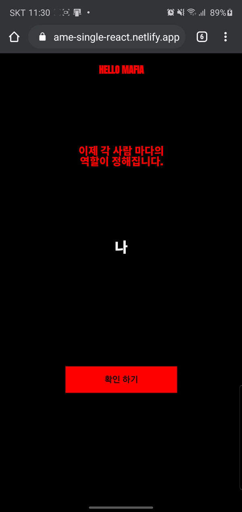
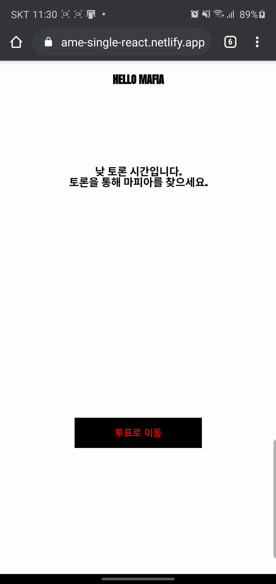
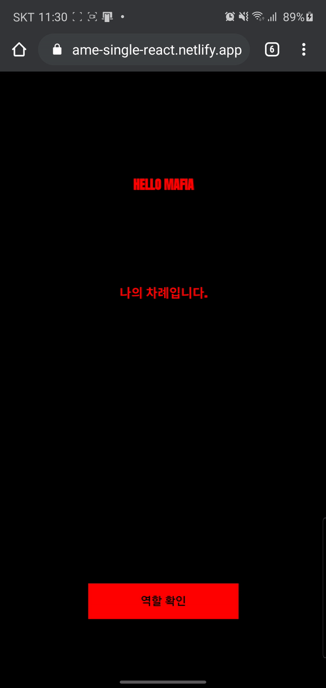

## Mafia Game 

### 개요 🚀

Mafia Game은 소수의 마피아, 다수의 시민으로 나뉘어 서로 생존을 가리는 **모노 게임**입니다. 게임에 반드시 필요한 **사회자** 를 대신하여 더욱 편의를 주기위해 이 프로젝트를 개발하였습니다.

### 개발 스펙 🏋️‍

- Javascript(ES6)
- React
  - react-router-dom
  - Context API
  - Immutable
  - jest, enzyme (테스트)
- netlify (Deploy)

---

### 게임 설명 🏃‍

#### 1. 게임설정 ⚙️

- 플레이어 수에 맞게 인원을 정하고 인원마다 이름을 정합니다.
- 각 직업의 수를 설정합니다. 
  - 플레이어 수 >= 각 직업의 인원 수 총합
- 무작위로 들어가게 할 직업 수를 정합니다. 
  - 해당 무작위 직업 설정은 직업 수보다 플레이어 수가 더 많을 경우 넣을 수 있습니다.
  - 이전의 직업수 설정을 제외한 나머지 직업에 대한 최대 수를 넣어 랜덤으로 값을 넣어줍니다.

> #### 직업설명
> - **경찰** 👮‍: 경찰은 밤에 다른 사람의 직업을 확인할 수 있습니다.
> - **의사** 👨‍⚕️: 의사는 밤에 마피아로부터 지목받은 사람을 선택해 살릴 수 있습니다.
> - **마피아** 🔪: 마피아는 밤에 사람을 지목하여 죽일 수 있습니다.
> - **시민** 🙎‍: 그저 선량한 시민..

#### 2. 직업 확인 ✔️

- 게임 설정이 끝나면 각 플레이어마다의 직업을 확인합니다.
- 화면에 플레이어 이름이 나오면 해당 플레이어 혼자 직업을 확인해야합니다.

#### 3. 게임 시작 🎮

게임의 순서는 아래와 같습니다.

> 낮토론 -> 낮투표 -> 낮투표결과 -> 밤(...) -> 밤투표결과 -> 낮토론 ...

- 낮, 밤 각각의 투표결과에 따라 플레이어를 떨어뜨립니다.
> - 마피아 승리 조건: 마피아 인원 수가 시민(경찰, 의사 포함..) 인원수와 같거나 많을 때 **마피아가 승리**합니다.
>
> - 시민 승리 조건: 마피아가 모두 죽었을 경우 **시민이 승리** 합니다.

##### 3.1 낮 ☀️

- 자유롭게 토론을 진행하며, 마피아로 의심되는 사람을 찾습니다.
- 각 플레이어는 마피아로 의심되는 사람을 투표합니다.
- 표를 가장 많이 받은 플레이어는 죽습니다. 🌇
- 투표가 동률이 나올 경우 **재투표**를 할지 **밤**으로 넘어갈지 선택합니다.

##### 3.4 밤 🌙

- 밤이 되면 각 플레이어는 본인의 직업의 역할을 수행합니다.

> - **경찰** 👮‍: 다른 사람의 직업을 확인할 수 있습니다.
> - **의사** 👨‍⚕️: 마피아로부터 지목받은 사람을 선택해 살릴 수 있습니다.
> - **마피아** 🔪: 사람을 지목하여 죽일 수 있습니다.
> - **시민** 🙎‍: 그저 선량한 시민. 아무런 행동을 하지 않습니다.
- 🌅 누가 죽었는지 결과가 나오며 마피아와 시민이 같은 비율로 살아남으면 마피아가 승리합니다.
- 게임이 끝나면 결과화면이 나오고 모든 플레이어의 직업을 확인할 수 있습니다.

 

### Contributor

- [정한영](https://github.com/JungHanYoung)(본인)
  - 디자인본을 통한 페이지 제작(React)
  - 프로젝트 구성 및 구현
  - 테스트 코드 작성(UI Test)
- [최병욱](https://github.com/ChoiBU)
  - 콘솔로 prototype 구현(C++)([repo](https://github.com/ChoiBU/MafiaGame_single_cpp))
  - 게임 스토리보드 기획 및 player 랜덤 세팅 모듈 구현([code](https://github.com/JungHanYoung/MafiaGame_single_react/blob/0209_develop/src/utils/setPlayers.js))
- [정지은](http://burnicknich.dothome.co.kr/)
  - UI 디자인
